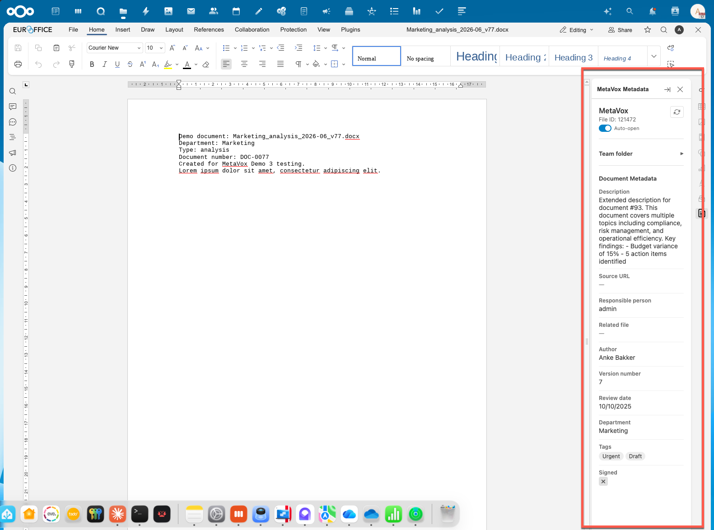

# Architecture

## Overview

The MetaVox Editor Plugin is an ONLYOFFICE/Euro-Office document editor plugin that displays and edits MetaVox metadata in a right-side panel.



## Current data flow (reverse proxy)

> **Note:** This is the interim architecture. The planned architecture uses JWT-based authentication directly with Nextcloud, eliminating the reverse proxy. See [security.md](security.md#planned-jwt-based-authentication).

```
┌──────────────────────────────────────────────────────────────┐
│ Browser                                                       │
│                                                               │
│  ┌──────────────────┐    ┌───────────────────────────────┐   │
│  │ Euro-Office       │    │ MetaVox Plugin (panelRight)   │   │
│  │ Document Editor   │    │                               │   │
│  │                   │    │  1. Read Asc.plugin.info      │   │
│  │ Provides:         │───▶│  2. Decode JWT from callback  │   │
│  │ - plugin.info     │    │  3. Extract fileId + filePath │   │
│  │ - documentCallback│    │  4. Resolve groupfolder ID    │   │
│  └──────────────────┘    │  5. GET /metavox-api/...      │   │
│                           └──────────────┬────────────────┘   │
│                                           │ same-origin        │
└───────────────────────────────────────────┼───────────────────┘
                                            │
                          ┌─────────────────▼──────────────┐
                          │ Reverse Proxy (NPM/nginx)       │
                          │ euro-office.example.com          │
                          │                                  │
                          │ /metavox-api/* ───────────────┐  │
                          │   + Basic auth header         │  │
                          │   + OCS-APIREQUEST            │  │
                          └──────────────────────────────┼──┘
                                                          │
                          ┌──────────────────────────────▼──┐
                          │ Nextcloud + MetaVox              │
                          │ nextcloud.example.com            │
                          │                                  │
                          │ /ocs/v2.php/apps/metavox/        │
                          │   api/v1/...                     │
                          └─────────────────────────────────┘
```

## Planned data flow (JWT authentication)

```
┌──────────────────────────────────────────────────────────────┐
│ Browser                                                       │
│                                                               │
│  ┌──────────────────┐    ┌───────────────────────────────┐   │
│  │ Euro-Office       │    │ MetaVox Plugin (panelRight)   │   │
│  │ Document Editor   │    │                               │   │
│  │                   │    │  1. Read Asc.plugin.info      │   │
│  │ Provides:         │───▶│  2. Extract JWT token         │   │
│  │ - plugin.info     │    │  3. Decode payload (fileId)   │   │
│  │ - documentCallback│    │  4. GET /ocs/.../editor/...   │   │
│  └──────────────────┘    │     ?doc=<JWT>                │   │
│                           └──────────────┬────────────────┘   │
│                                           │ cross-origin       │
│                                           │ (no preflight —    │
└───────────────────────────────────────────│  simple GET)       │
                                            │
                          ┌─────────────────▼──────────────┐
                          │ Nextcloud + MetaVox             │
                          │ nextcloud.example.com           │
                          │                                 │
                          │ EditorController:               │
                          │   1. Validate JWT (HS256)       │
                          │   2. Check fileId match         │
                          │   3. Return metadata            │
                          │                                 │
                          │ No proxy needed.                │
                          └─────────────────────────────────┘
```

## File ID detection

The ONLYOFFICE Nextcloud connector sets a `documentCallbackUrl` in the editor config. This URL contains a JWT token as the `doc` query parameter:

```
https://nextcloud.example.com/index.php/apps/onlyoffice/track?doc=<JWT>
```

The JWT payload (base64-encoded) contains:

```json
{
  "userId": "admin",
  "ownerId": "admin",
  "fileId": 121442,
  "filePath": "/Demo 3/Reports/file.docx",
  "shareToken": null,
  "action": "track"
}
```

The plugin extracts `fileId` and `filePath` by decoding the JWT payload (no signature verification needed client-side — the server validates the full JWT).

## Groupfolder detection

MetaVox stores metadata per groupfolder. The plugin needs the groupfolder ID to fetch correct metadata. Detection flow:

1. Extract `filePath` from JWT (e.g., `/Demo 3/Reports/file.docx`)
2. Take the first path segment as the groupfolder name (`Demo 3`)
3. Fetch groupfolders list from API
4. Match the name to find the groupfolder ID
5. Use the groupfolder-scoped metadata endpoint

## API endpoints used

### Current (via proxy)

| Method | Proxy URL | Nextcloud URL | Purpose |
|--------|-----------|---------------|---------|
| GET | `/metavox-api/groupfolders` | `/ocs/.../api/v1/groupfolders` | List groupfolders |
| GET | `/metavox-api/groupfolders/{gfId}/metadata` | `/ocs/.../api/v1/groupfolders/{gfId}/metadata` | Team folder metadata |
| GET | `/metavox-api/groupfolders/{gfId}/files/{fileId}/metadata` | `/ocs/.../api/v1/groupfolders/{gfId}/files/{fileId}/metadata` | File metadata |
| POST | `/metavox-api/groupfolders/{gfId}/files/{fileId}/metadata` | `/ocs/.../api/v1/groupfolders/{gfId}/files/{fileId}/metadata` | Save file metadata |

### Planned (direct, JWT-authenticated)

| Method | URL | Purpose |
|--------|-----|---------|
| GET | `/ocs/.../api/v1/editor/groupfolders?doc=<JWT>` | List groupfolders |
| GET | `/ocs/.../api/v1/editor/groupfolders/{gfId}/metadata?doc=<JWT>` | Team folder metadata |
| GET | `/ocs/.../api/v1/editor/files/{fileId}/metadata?doc=<JWT>` | File metadata |
| POST | `/ocs/.../api/v1/editor/files/{fileId}/metadata?doc=<JWT>` | Save file metadata |

### Response format

```json
{
  "ocs": {
    "meta": { "status": "ok", "statuscode": 200 },
    "data": [
      {
        "id": 4,
        "field_name": "file_gf_department",
        "field_label": "Department",
        "field_type": "select",
        "field_options": ["Finance", "HR", "IT", "R&D"],
        "is_required": false,
        "applies_to_groupfolder": 0,
        "value": "R&D"
      }
    ]
  }
}
```

## Rendering

Fields are split into two sections:

1. **Team folder** (read-only, `applies_to_groupfolder=1`) — collapsible, collapsed by default
2. **Document Metadata** (editable, `applies_to_groupfolder=0`) — click-to-edit inline

Field values are rendered based on `field_type`:

| Type | Read display | Edit control |
|------|-------------|--------------|
| `text`, `textarea` | Plain text | `<input>` / `<textarea>` |
| `number` | Number | `<input type="number">` |
| `date` | Localized date | `<input type="date">` |
| `select` | Plain text | `<select>` with options |
| `multiselect` | Pill tags | Checkboxes |
| `checkbox` | ✓ / ✗ toggle | Direct click toggle |
| `url` | Clickable link | `<input type="url">` |
| `user` | User ID | `<input type="text">` |
| `filelink` | File reference | `<input type="text">` |

## Auto-open and user preferences

The plugin supports automatic opening when a document is loaded. This requires two layers:

### Server-side: autostart

The DocumentServer config (`local.json`) includes the plugin GUID in `services.CoAuthoring.plugins.autostart`. This causes the DocumentServer to initialize the plugin automatically when any document opens.

### Per-user: localStorage toggle

When the plugin initializes, it checks `localStorage` for a `metavox_auto_show` preference:

- **`true`** (default) — plugin loads metadata normally
- **`false`** — plugin shows a disabled message; user can re-enable via the toggle

The toggle switch is rendered in the plugin header. Clicking it updates `localStorage` immediately. The preference persists per browser/device (localStorage is scoped to the DocumentServer domain).

```
init()
  → check localStorage('metavox_auto_show')
  → if 'false': show disabled message, stop
  → if 'true' or not set: resolve groupfolder, load metadata
```

## ONLYOFFICE Plugin API

| API | Usage |
|-----|-------|
| `window.Asc.plugin.init` | Entry point — called when the plugin panel opens |
| `window.Asc.plugin.info` | Contains `documentCallbackUrl`, `documentTitle`, `userId`, `lang`, `theme` |
| `window.Asc.plugin.onThemeChanged` | Called when the editor theme changes — updates CSS variables |
| `window.Asc.plugin.onExternalMouseUp` | Required stub |

## File overview

| File | Responsibility |
|------|---------------|
| `config.json` | Plugin manifest — `panelRight` variation, `isActivated: true`, supported editors |
| `plugin.js` | Core: JWT decoding, groupfolder detection, API fetch/save, inline editing, rendering |
| `index.html` | Panel HTML shell with header and refresh button |
| `styles.css` | Styling with CSS variables for editor theme support |
| `vendor/plugins.js` | Bundled ONLYOFFICE plugin SDK |
| `resources/icon.svg` | Toolbar icon |
